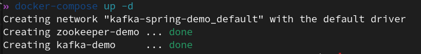

# Kafka Concepts Demo with Spring Boot and Spring Kafka

### This project demonstrates basic Kafka concepts using Spring Boot and Spring Kafka. The demo includes setting up a Kafka broker and a Zookeeper instance using Docker Compose, along with a simple Spring Boot application that produces and consumes messages from a Kafka topic.

## Prerequisites
- Java 21
- Apache Maven for the build tool
- Kafka and Zookeeper (Using Docker latest versions for both .. You can find the docker-compose file for both of them in ``docker-compose.yaml`` in the repository files) 
    - This project uses Docker for both Kafka and Zookeeper so if you dont have docker and will use it please refer to https://docs.docker.com/engine/install/ 

## Getting Started
#### NOTE :  If you have Kafka and Zookeeper on your machine you can skip this part but for simplicity you can just have docker and docker-compose installed 

### Setting Up Kafka and Zookeeper

1. Ensure Docker is running on your machine. 
2. Clone this repository.
3. Navigate to the project directory.
4. Start Kafka and Zookeeper using Docker Compose

### Then you can start the containers in the docker-compose file on the command line by writing 
``docker-compose up -d``
### This should be the output  or if you are using Docker Desktop on Windows it should have a similar output by saying both created successfully