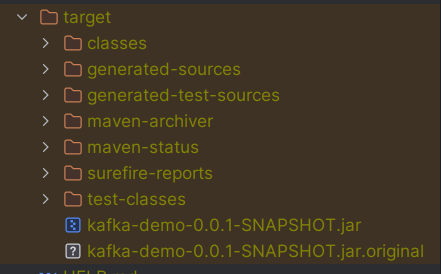

# Kafka Concepts Demo with Spring Boot and Spring Kafka

### This project demonstrates basic Kafka concepts using Spring Boot and Spring Kafka. The demo includes setting up a Kafka broker and a Zookeeper instance using Docker Compose, along with a simple Spring Boot application that produces and consumes messages from a Kafka topic.

## Prerequisites
- Java 21
- Apache Maven for the build tool
- Kafka and Zookeeper (Using Docker latest versions for both .. You can find the docker-compose file for both of them in ``docker-compose.yaml`` in the repository files) 
    - This project uses Docker for both Kafka and Zookeeper so if you dont have docker and will use it please refer to https://docs.docker.com/engine/install/ 


## Getting Started
#### NOTE :  If you have Kafka and Zookeeper on your machine you can skip this part but for simplicity you can just have docker and docker-compose installed 

### Setting Up Kafka and Zookeeper

1. Ensure Docker is running on your machine. 
2. Clone this repository.
3. Navigate to the project directory.
4. Start Kafka and Zookeeper using Docker Compose

### Then you can start the containers in the docker-compose file on the command line by writing 
``docker-compose up -d``
### This should be the output


 or if you are using Docker Desktop on Windows it should have a similar output by saying both created successfully

# How to run
### There are two seperate projects ``producer`` and ``consumer``
### You can build and run using the IDE if you want to depending on what your IDE is but this project uses maven for the build tool by first building the project using ``mvn install`` inside the ``producer`` and ``consumer`` separately .. this will build and package both applications as a ``jar`` in the ``target`` directory for each of them

### You should have now this directory in both applications 


### Now you can run using ``java -jar kafka-demo-0.0.1-SNAPSHOT.jar`` .. NOTE this name can be changed as you like inside the ``pom.xml`` using ``artifact`` and ``version`` tags


# Kafka Producer Service

### Currently there are endpoints for producing both Sync and Async messages, handling both Strings and JSON in the producer. Additionally, we use Avro with a schema registry for serialization and deserialization of messages.

## Endpoints

### 1 - String Message

#### Synchronous Message
``` 
GET   http://localhost:8181/orders/sync/{customerEmail}
```
- Sends a synchronous message.
- Includes a dummy 5-second Thread.Sleep to simulate latency.
- Replace {{customerEmail}} with any dummy email address

#### Asynchronous Message

```
GET   http://localhost:8181/orders/async/{customerEmail}
```

- Sends an asynchronous message.
- Replace `{customerEmail}` with any dummy email address.

### - JSON Message

#### Synchronous Message
``` 
POST http://localhost:8181/profiles/sync
Content-Type: application/json

Request Body :
{
  "name": ,
  "age": 
}
```
- Sends a synchronous message with a JSON payload.
- Replace the example data with actual values.

#### Asynchronous Message

```
POST http://localhost:8181/profiles/async
Content-Type: application/json

Request Body : 
{
  "name": ,
  "age": 
}
```

- Sends an asynchronous message with a JSON payload.
- Replace the example data with actual values.


